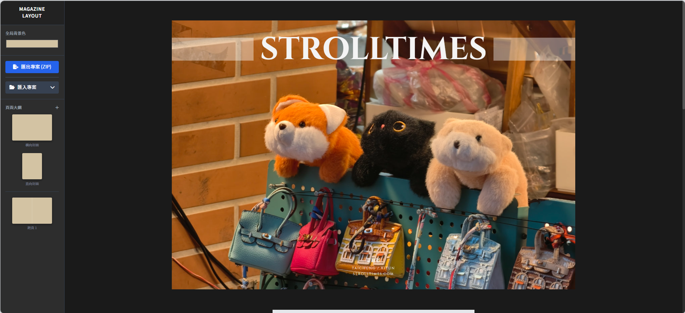

# Magazine Layout Tool 專業雜誌排版工具

這是一個基於純瀏覽器技術的高效、精準的雜誌排版工具。它專為需要快速將照片與文字排版成具備設計感的雜誌頁面而開發。

## 核心功能特色

*   **精準 PX 原生佈局：** 摒棄傳統拖曳建站工具不可控的縮放問題，採用絕對 PX 定位，確保「所見即所得」，輸出的圖片比例與網頁上看到的一模一樣。
*   **靈活的排版網格系統：** 內建多種照片排版版面 (Layouts)，包括滿版、上下分割、左右分割、三格、四格等，可一鍵切換。
*   **跨頁滿版支援 (Panorama)：** 可將左右兩頁合併為一個連續無縫的 3:2 跨頁全景版面。
*   **高畫質原生截圖輸出：** 透過內建的 Node.js/Puppeteer 伺服器進行無頭瀏覽器渲染，匯出真正的高畫質 JPEG，並自動分類為「直向單頁」與「橫向跨頁」資料夾，打包成 ZIP 下載。
*   **智慧型圖片編輯模式：** 點擊照片即可進入編輯模式，支援滑鼠滾輪縮放、拖曳平移以及四角的拖曳縮放，照片自動計算邊界，保證不會破版露白。
*   **專屬客製化浮水印：** 支援為每張照片開啟專屬的簽名浮水印，可自訂透明度，並提供「左下、中下、右下」三個快速定位按鈕，亦可自由拖曳。
*   **主視覺藝術文字設計：** 支援添加具備層次感的排版文字 (標題、副標、簽名)，並提供專屬工具列進行九宮格快速對齊與拖曳。
*   **專案存檔與還原功能：** 匯出時會自動產生輕量化的 `layout_settings.txt` (不包含笨重的圖片)。日後只需匯入該設定檔並選取原圖資料夾，即可瞬間還原之前的排版狀態。

## 操作方法

### 1. 啟動伺服器與開啟工具
本工具依賴本地 Node.js 伺服器來進行高畫質截圖與專案打包，因此必須透過腳本啟動：
1.  雙擊執行專案資料夾內的 `start.bat`。
2.  腳本會自動檢查環境套件，完成後會自動開啟瀏覽器並進入 `http://localhost:3000/index.html`。
*(注意：使用時請勿關閉背景黑色的終端機視窗，否則將無法匯出。)*

### 2. 建立頁面與套用版型
*   **新增頁面：** 點擊左側面板「頁面大綱」右側的 `+` (新增空白跨頁) 按鈕，會自動產生左右兩頁。
*   **切換版面 (Layout)：** 游標移至排版區上方，會浮現深色的「控制列」，點擊前方的幾個方塊圖示即可切換單一頁面的照片網格佈局。
*   **跨頁滿版：** 若需要一張照片橫跨左右兩頁，請點擊**左頁**控制列上的「山水畫 (Panorama)」圖示，此時右頁將會自動隱藏，左頁延伸為 3:2 滿版。

### 3. 上傳與編輯照片
*   **新增照片：** 直接點擊灰色區塊 (`+ 點擊加入圖片`) 即可選擇本地圖片上傳。
*   **編輯照片位置/大小：** 點選已置入的照片，周圍會出現藍色虛線框，此時您可以：
    *   **平移：** 按住滑鼠左鍵拖曳照片。
    *   **縮放 (滾輪)：** 在照片上滾動滑鼠滾輪進行縮放。
    *   **縮放 (邊角)：** 拖曳藍框四周的白色圓點進行縮放。
    *(系統已設定智慧邊界防護，照片縮放與拖曳時不會露出灰色底色。)*
*   **設定浮水印：** 在照片的藍框編輯模式中，點擊上方工具列的「簽名」圖示開啟浮水印。您可以利用展開的工具列設定透明度、使用右側三個按鈕快速定位至下方，或直接按住浮水印文字進行自由拖曳。
*   **更換照片：** 在編輯模式下，點擊上方工具列的「循環 (Sync)」圖示即可重新選擇圖片替換。點擊空白處可退出編輯模式。

### 4. 添加裝飾與文字
*   **開啟/關閉裝飾：** 透過頁面上方的控制列，可以切換「邊框」、「主視覺文字」、「Logo」與「飾字」。
*   **編輯主視覺文字：**
    *   直接點擊文字區塊修改內容 (支援簽名、主標題、副標題)。此處的修改會自動套用至全域設定。
    *   將游標移至文字上方會浮現工具列，您可以透過工具列進行左中右對齊、九宮格快速定位，或是拖曳左側的十字手把自由移動位置。

### 5. 匯出專案 (Export)
完成排版後，點擊左側面板的 **「匯出專案 (ZIP)」** 按鈕。
*   系統會在背景啟動無頭瀏覽器，精準擷取每一個頁面。
*   稍待片刻，瀏覽器會自動下載名為 `Magazine_Project.zip` 的壓縮檔。
*   **壓縮檔內容包含：**
    *   `Landscape (3-2)/`: 所有橫向的跨頁全景圖 (適合網站首頁輪播或電腦螢幕瀏覽)。
    *   `Portrait (3-4)/`: 所有直向的單頁切割圖 (包含左右頁，適合放進手機版網頁或 IG 限動)。
    *   `layout_settings.txt`: 輕量化的專案設定檔。

### 6. 專案還原 (Import)
若日後需要修改已排版的專案：
1.  點擊左側面板的「匯入專案」展開選單。
2.  **步驟一 (設定文件)：** 點擊瀏覽，選擇之前匯出 ZIP 裡面的 `layout_settings.txt`。
3.  **步驟二 (圖片路徑)：** 點擊瀏覽，選擇**存放您原始照片的資料夾**。
4.  點擊「開始匯入」，系統將自動重建網格，並依照檔名自動從您的資料夾中把圖片原封不動地貼回當時的位置與縮放比例。